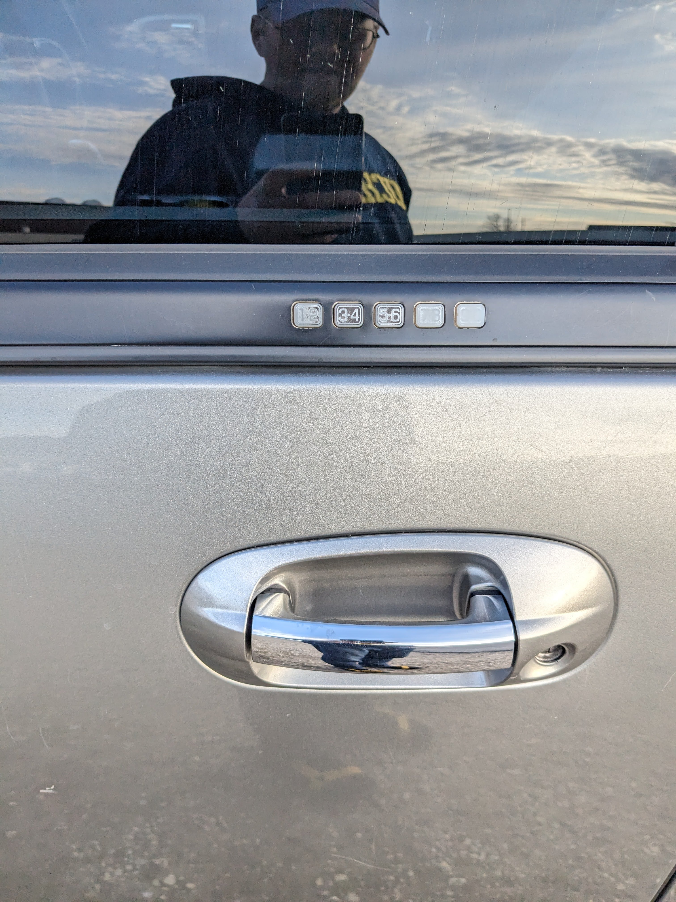

# Ford Lock

I noticed this keyless entry code lock on the driver's door of a Ford Expedition one afternoon.  Not my truck, but the wear pattern makes the entry code significantly easier to guess?

Failure mode is probably a mix of human finger sweat+oil, mixed with rubber and sunlight?  

