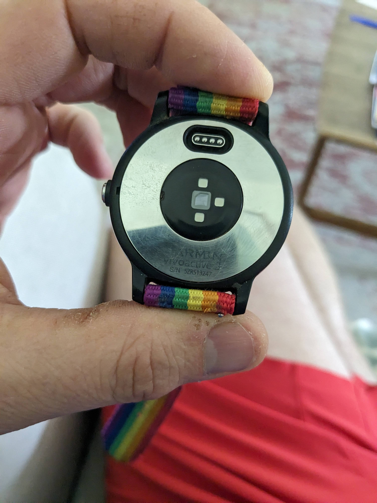

# Garmin Watch

After maybe 3 - 5 years of use the battery would only hold a charge for ~20 minutes of recording a bike ride.  

Sent back to Garmin for a new battery (replacement/refurbished unit).  Replacement was about $60, shipping took a week. Needed the serial number on the back of the watch. 

I probably coild have bould a new battery for the watch for less that $60, but I wasn't confident I'd be able to seal the casing properly. Replacement unit works great.

