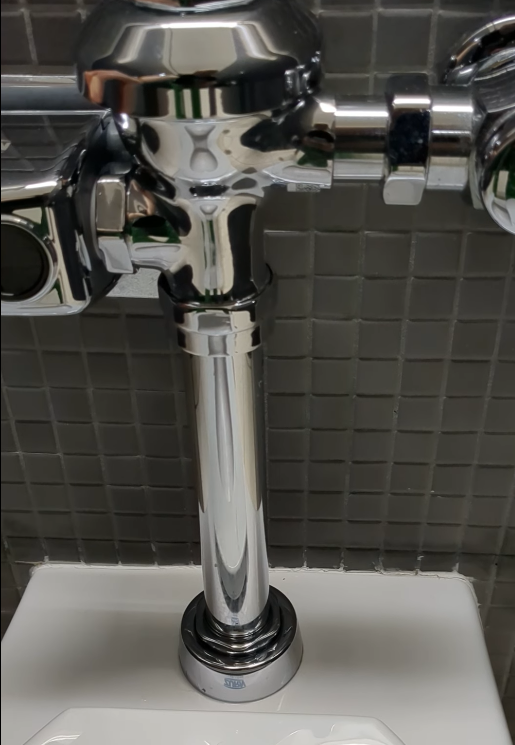

# Leaking Toilet

The plumbing in Pasteur Hall is weird. all of the cold water lines are flused with really hot water about once an hour.  Why?  We don't know - it might be a sanitation thing, and it might be a keep the pipes from freezing thing.

One day I noticed a related failure in the flusing of this toilet.  

Fixed via a call to maintence.  I think they porobably just tightened the nuts/collars holding the assembly together.

<video src="./Pasteur_toilet.mp4" width="320" height="240" controls></video>

