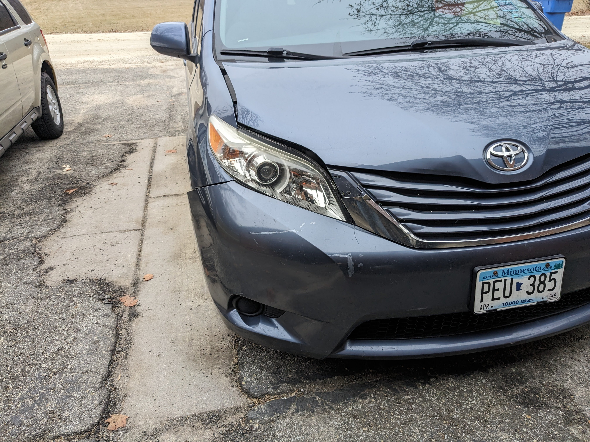
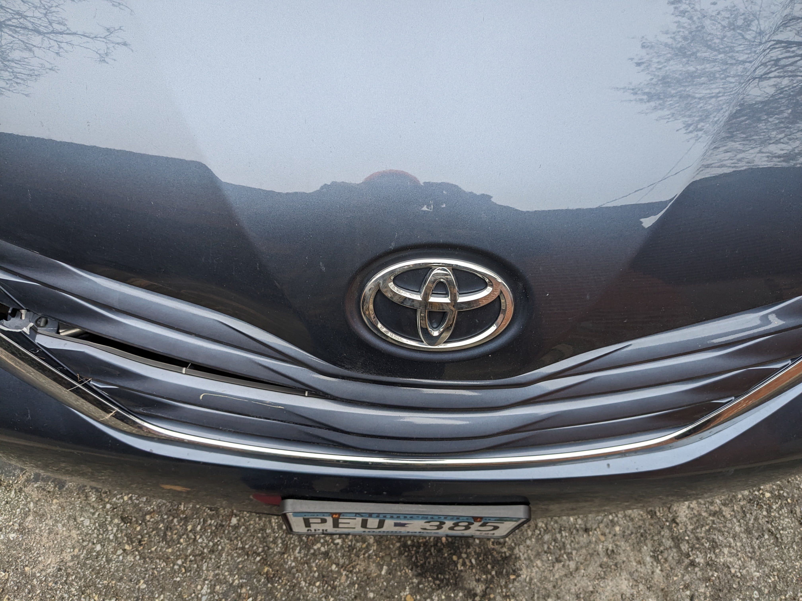
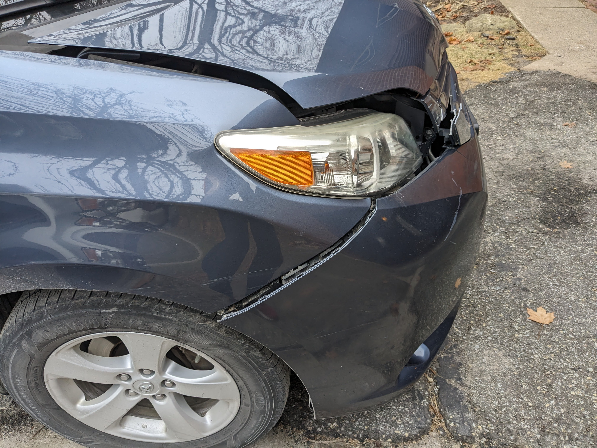
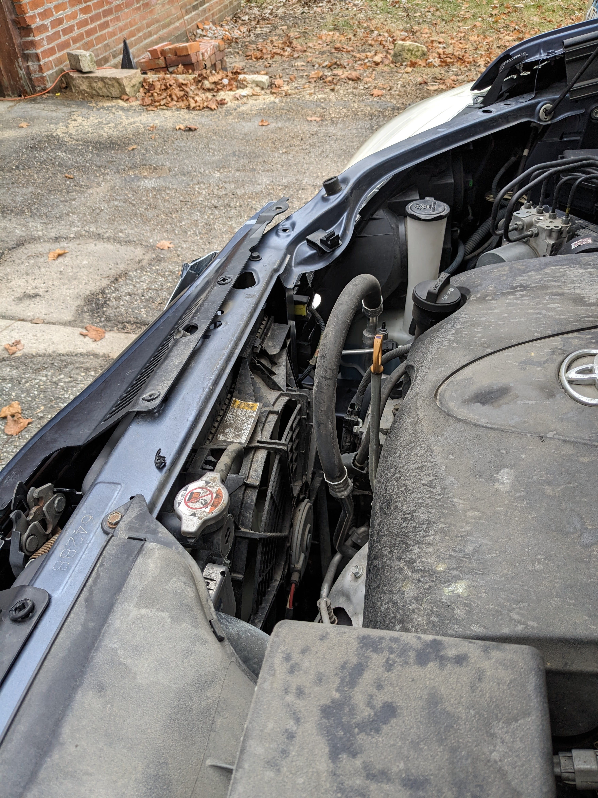

# The second deer was the one I hit

I slowed to a stop for the first deer, honked my horn, and it ran out of the way.  When I was back up to maybe 20mph the second deer jumped out and I couldn't miss it.  The deer's damage seemed minimal, it flipped in a circle and rn off.  The van needed professional repair, including both headlights and most of the panels forward of the windshield and doors.  

