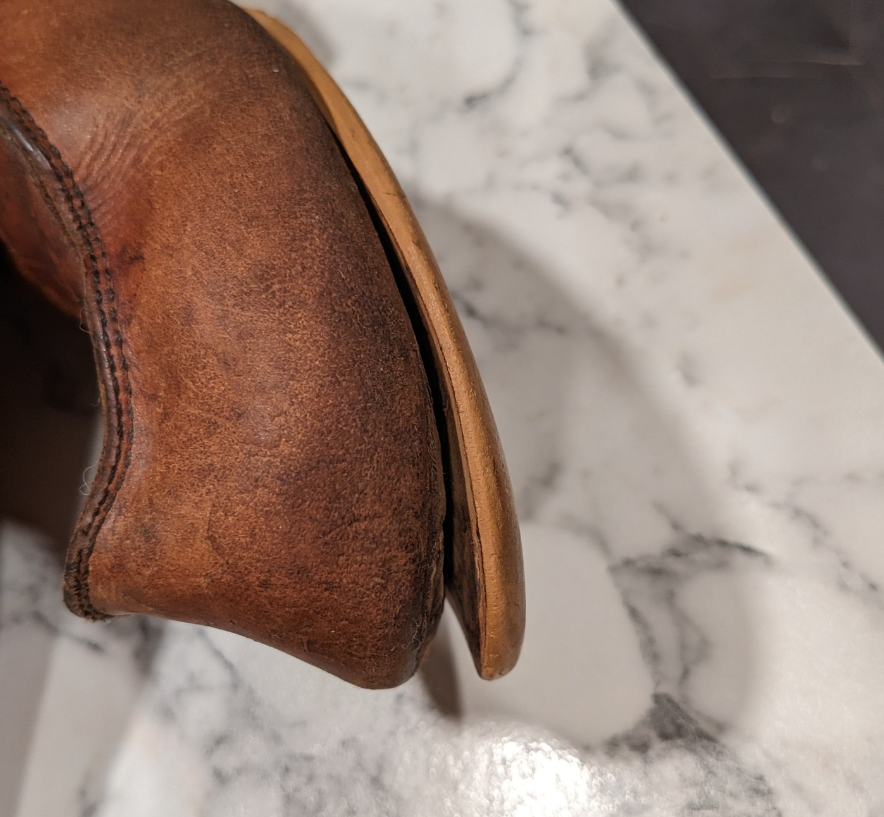
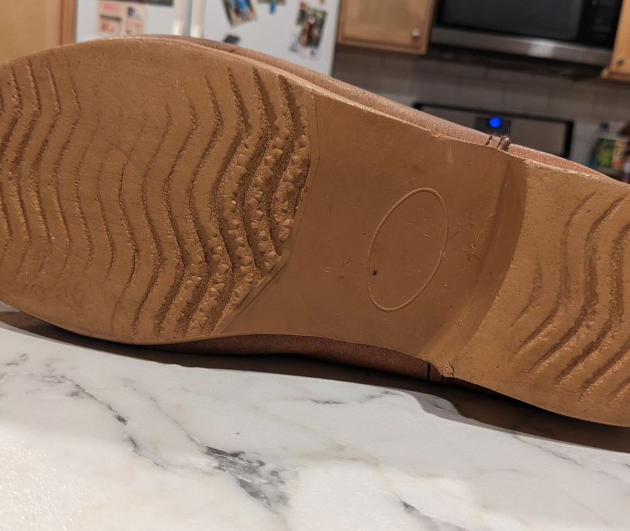
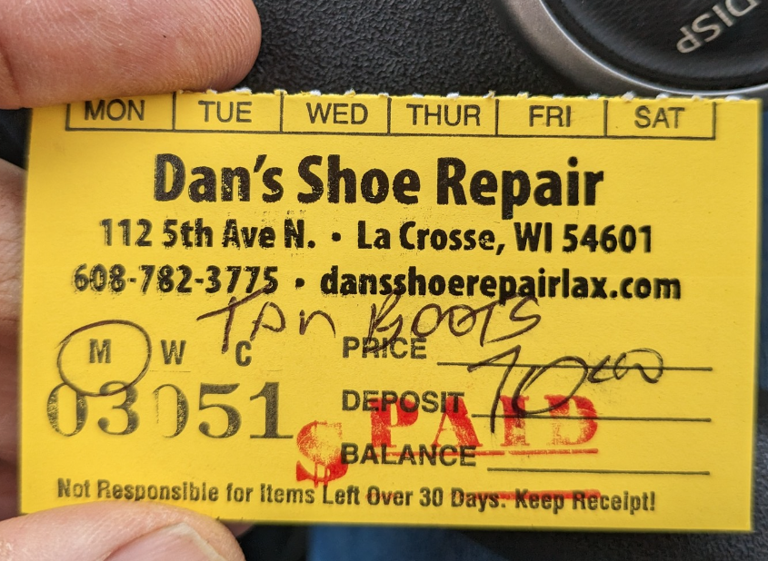
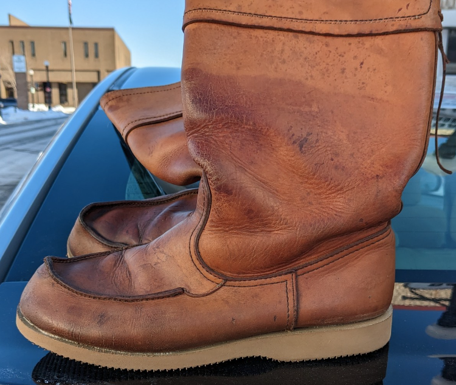

# Old Boots

I received these boots from a relative, who bought them in 1970's Sweden.  The soles were super slick and were pulling away from the upper. Nobody repairs boots anymore!  I had to go to a shop 40 miles from my house to get new soles installed.  
 

