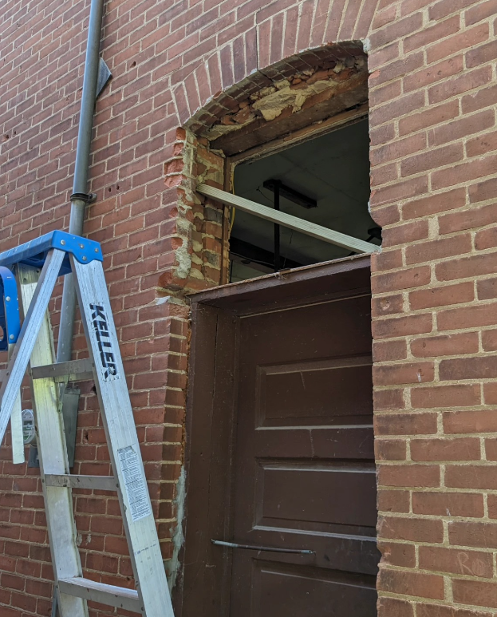
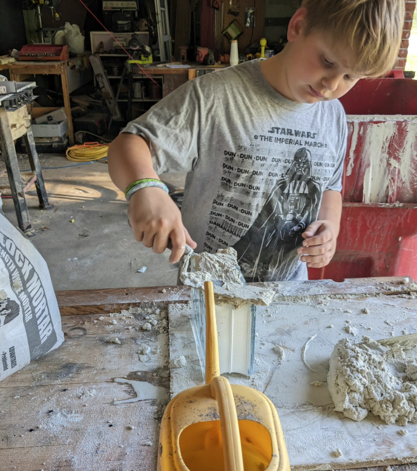
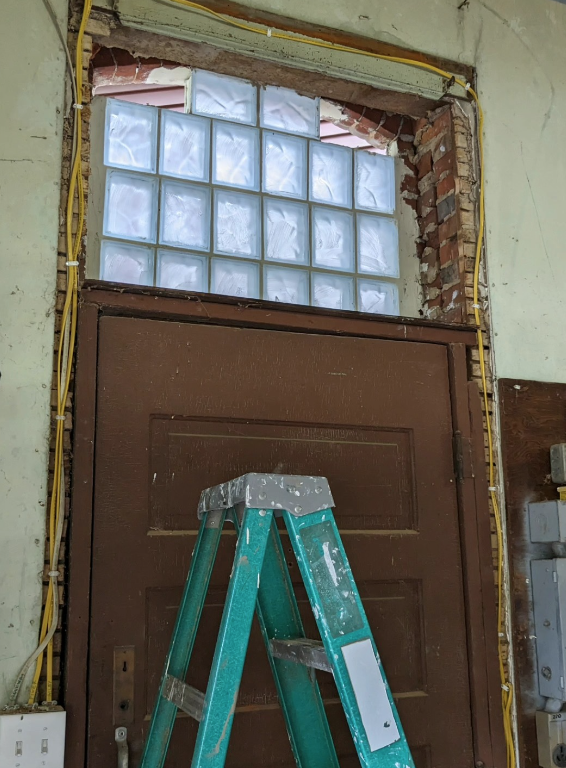
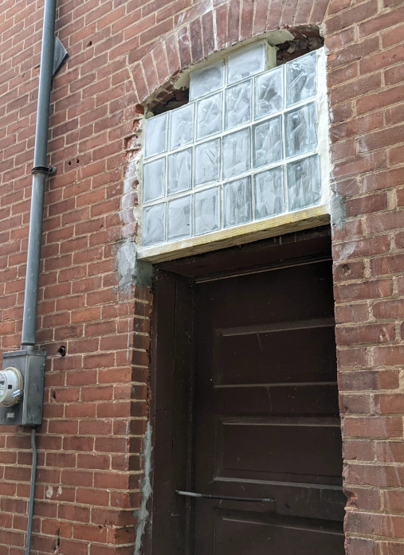

# Brick Fill above a garage door

Our garage was originally a brick schoolhouse.  Someone else did the conversion and made all of our neighbors mad.  One of the windows was converted into a (side) service door for the garage, but the location of the door didn't match that of the window.  They filled the space above the door with brick.  

One afternoon, while installing an outdoor light, I leaned on this brick and learned that it had broken loose and would rock back and forth 1/4" when you leaned on it. 

So, my son and I tore the fill out and replaced it with glass block, which is certainly lighter than brick!

