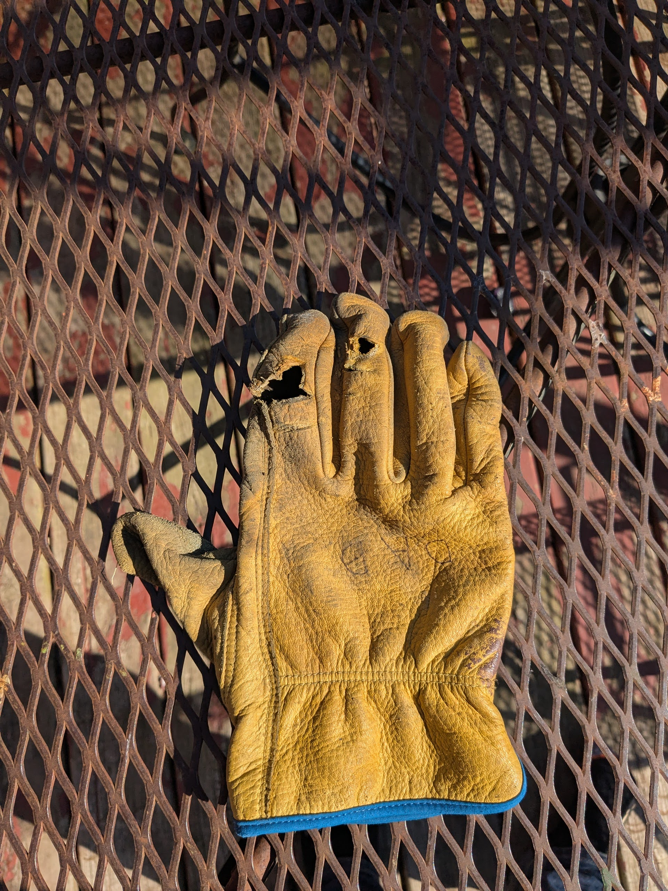

# My finger

My finger got caught in the pulley mechanism of the Honda small engine that drives our garden tiller.  Why did I poke the pulley with my finger while the motor was running?  I have no idea.  I guess that's what makes it an accident?  

Here's the glove that got pulled into the pulley.

My finger was stuck where the arrow indicates.  Surprisingly, not amputated.  

Note the groove cut into my finger bone.

The ER (plastic surgery) docs at Mayo decided I needed to have finger surgery to clean the dirt out of the damaged bone (visible in the photo).  They said it wasn't the worst (by far) thing they'd seen that night.  April is apparently small-engine season at the hospital.  If you ever get a cut and bone is showing, go to the ER right away.  Bones are porous and it's hard to get bacteria out of them once they're contaminated.  Don't wait a week!

Thankfully, no gangrene (hooray for [infectious disease docs](https://www.mayoclinic.org/departments-centers/infectious-diseases/sections/overview/ovc-20456906)!) and a mostly functional right index finger (Thanks [Dr Bakri]( https://www.mayoclinic.org/biographies/bakri-karim-m-b-b-s/bio-20094522) !).  Using the toilet with your non-dominant hand is much harder than you'd think (try it!).  Physical/Occupational therapy is great!  It's nice to have good health insurance and a nice family!  

