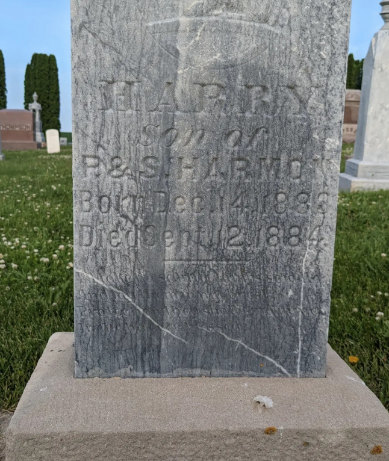

# Grave Markers

Here are some very old marble grave markers at the[Lewiston Minnesota Public Cemetary](https://maps.app.goo.gl/a5XSe6DxDgqDkuEj8).  The grave markers seem to be carved out of marble, which decays over time in the presence of acid or water.  

Also, vaccinate your kids!

