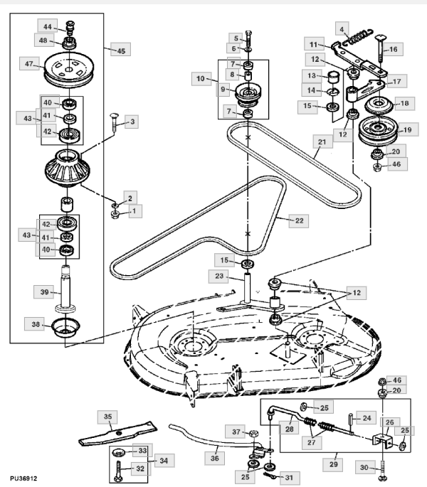
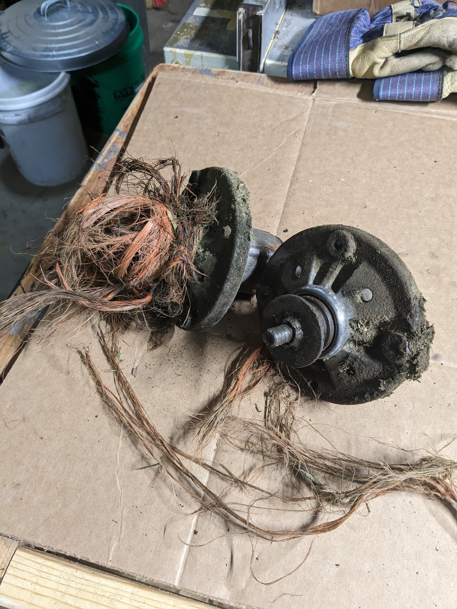
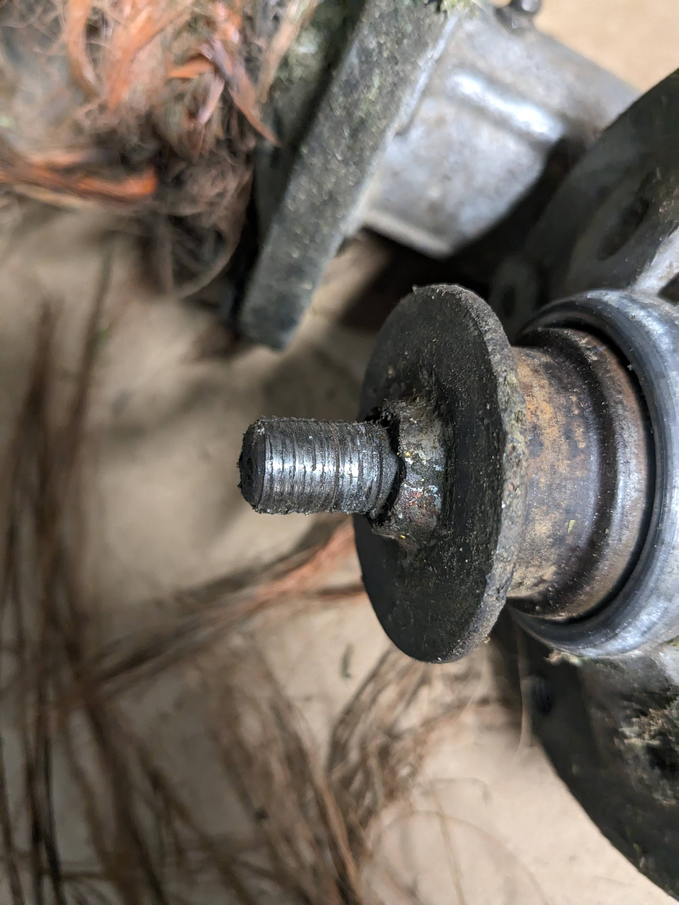
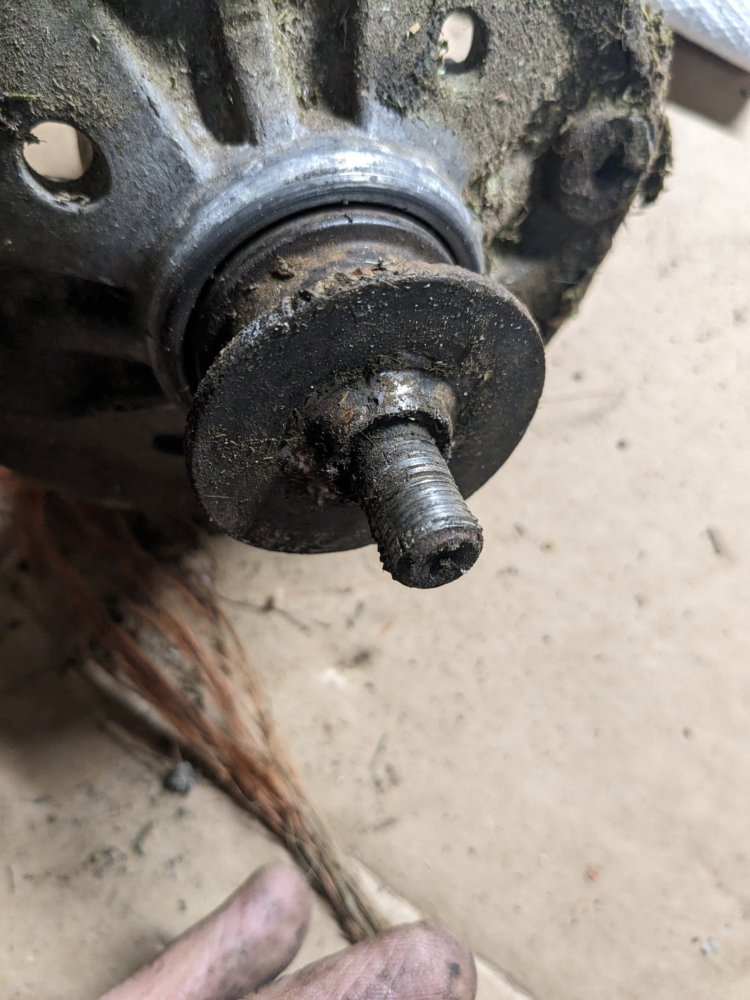
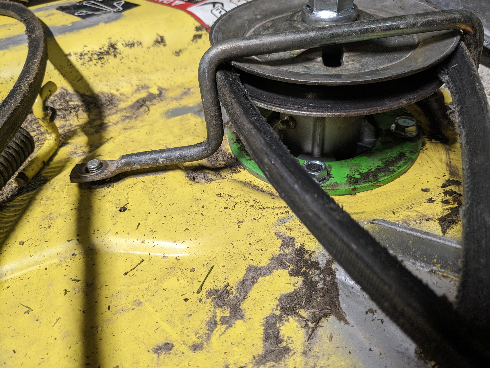

# Mower Spindle

Part number: Mower deck spindle, GX22186

Application: John Deere 42c mower deck. via (https://partscatalog.deere.com/jdrc/) specifically (https://partscatalog.deere.com/jdrc/sidebyside/equipment/72635/referrer/navigation/pgId/298050661)

 

In the diagram, part no 45 is what I replaced, the threads and blade keys on on the bottom of part 39 had stripped off / worn away.

  
  
  

How did things fail?  Here's a guess:
1. orange poly twine gets mowed over and some gets caught in the mower deck spindle.
2. Twine, rocks, fallen branches etc mean the engine pushes hard on the spindle.
3. A harder push wears away at the 7-lobe gear/key that spins the mower blade.
4. Oh, the blade is loose - I'd better tighten the blade nut with a bigger wrench.
5. stripped threads on the bottom of part 39.

The Amazon replacement units fit - mostly.  They're a bit too tall, which means the belt guide doesn't quite fit.

