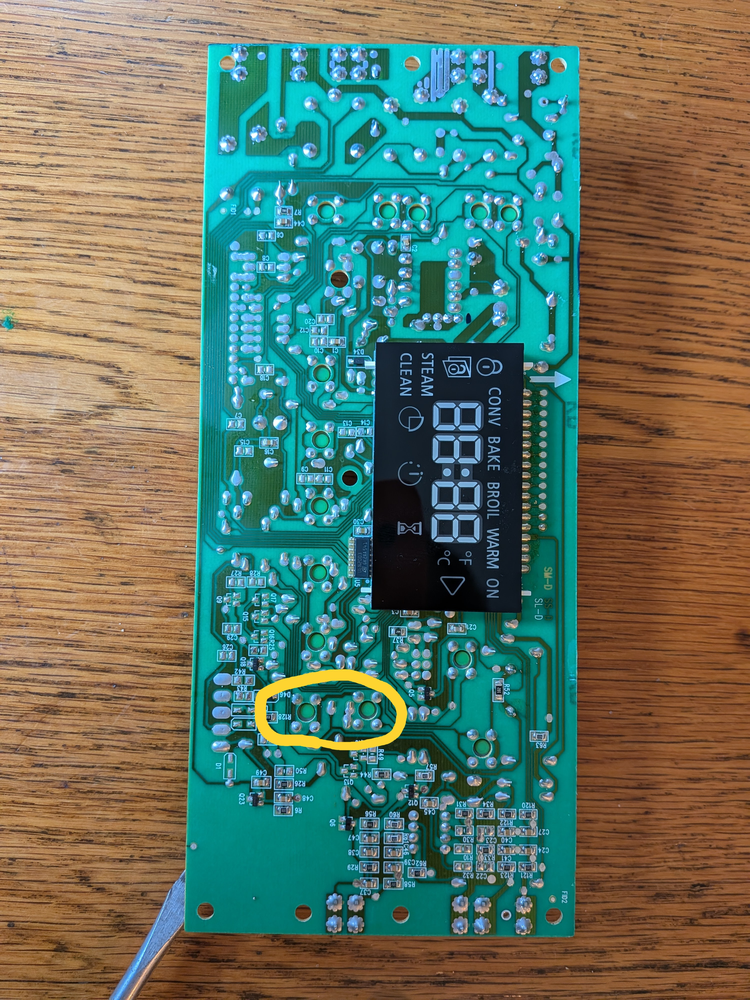

# Whirlpool Oven Control Panel

Model Number:	WFG540H0ES0

Serial Number:	R60955692

Backstory: 10 year old oven control panel stopped responding to the "up/down" buttons on the control panel.  Kind-of a drag, because the timer, oven temperature, clock etc all need the up/down buttons be useful.  We baked things at 350F for a week, and then my 12yo son told me that we should fix it. 

The control panel circuit board was behind two screws and a piece of sheet metal on the back of the stove.  One of the plastic fingers that pushes the button switches on the circuit board had broken.  5-minute epoxy seemed to be a good enough fix. 
  
  

  

  

         

         

  

          

