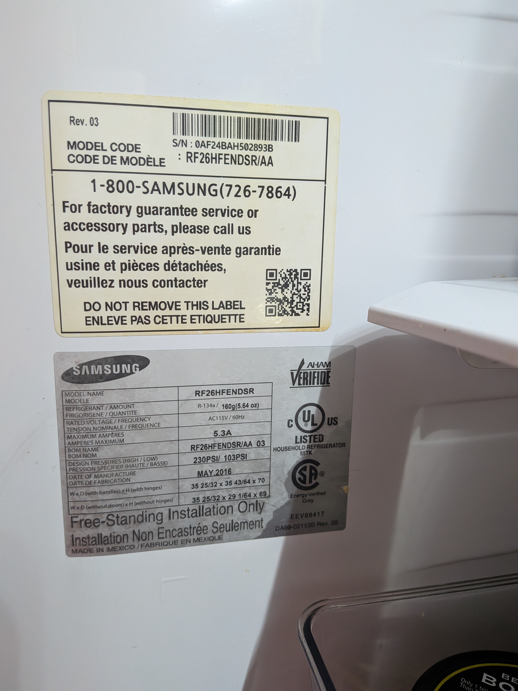
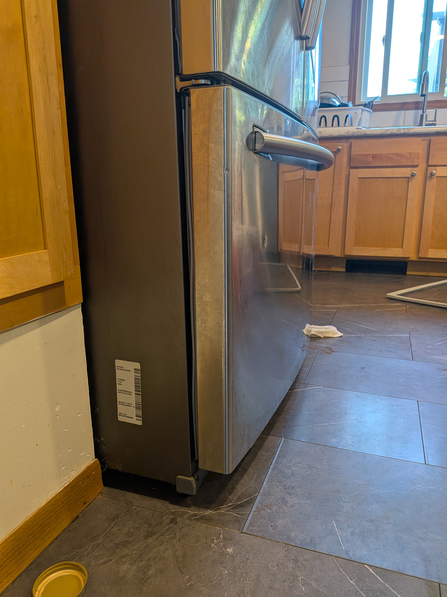
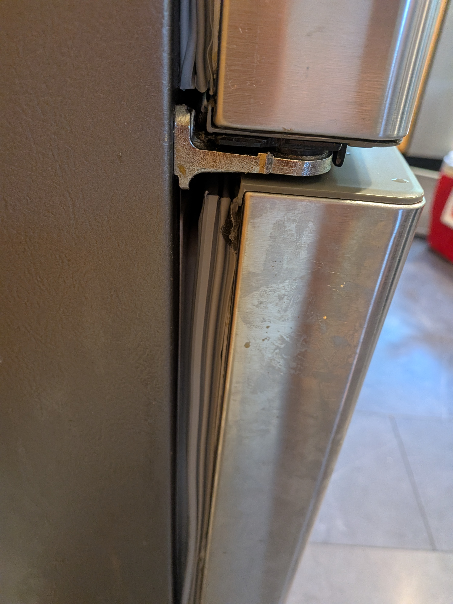
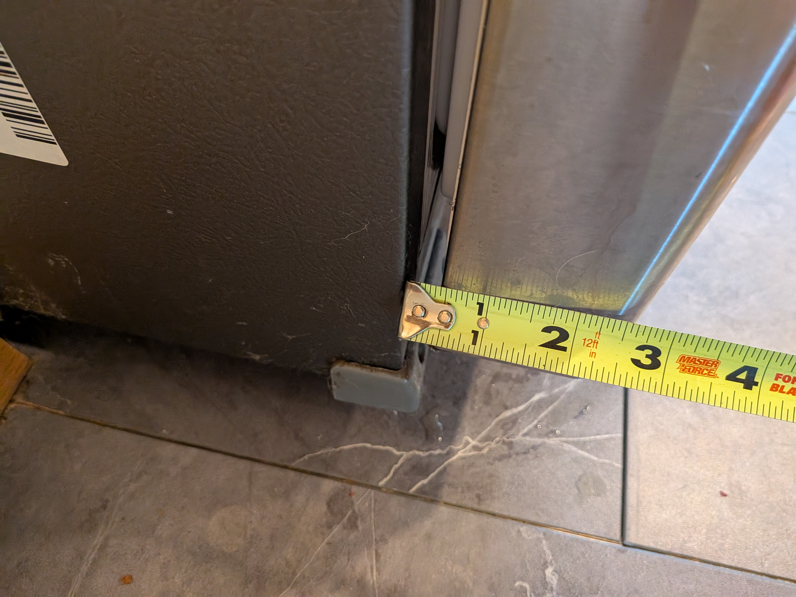
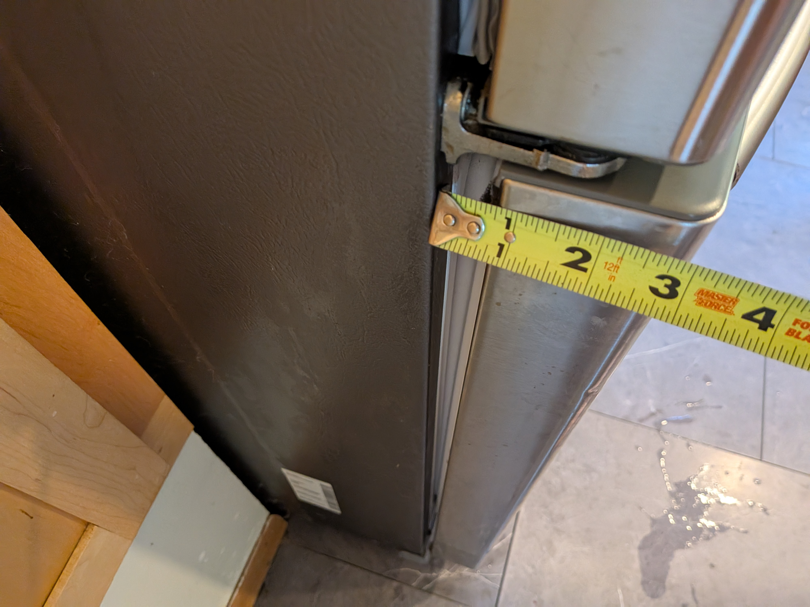
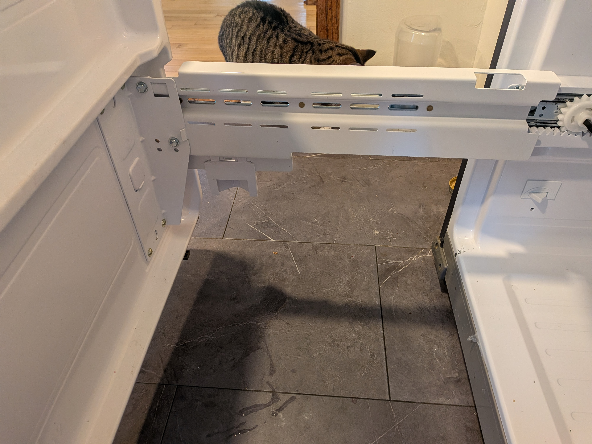
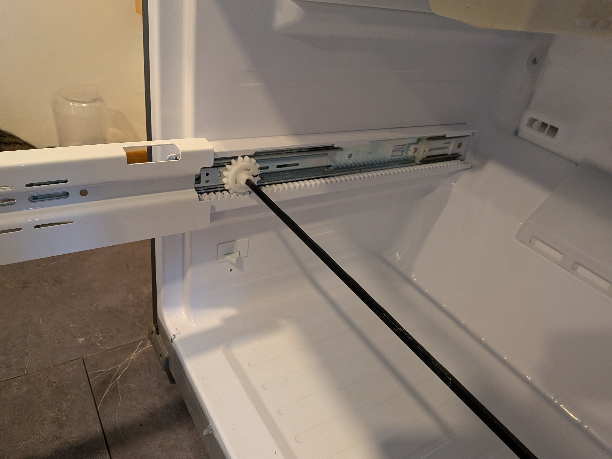

# Samsung Fridge Drawer

Model Number: RF26HFENDSR/AA

Serial Number:	0AF24BAH502893B

Backstory: ~9 year old Samsung "French Door" fridge stopped working.  The freezer filled up with frost, the cooling air passage up to the fridge filled with ice, and things started to spoil at a 55F fridge temperature.  

We thought the problem was a air leaks from an old rubber gasket around the fridge doors.  That wasn't the case though.  While replacing the gasket around the freezer drawer, we realized that the freezer door wasn't plumb, because the rails that carried it drooped down.  We couldn't figure out how to level the rails and gave up.  There was nothing wrong with the electrical/refrigeration system.  Why were the rails bent?  Maybe someone leaned on the freezer drawer?  Who knows... 
  
  

  

  

         

         

  

          

