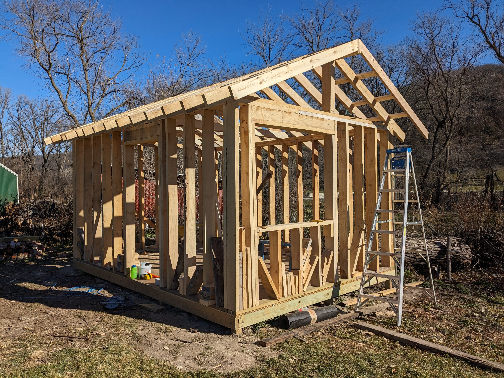
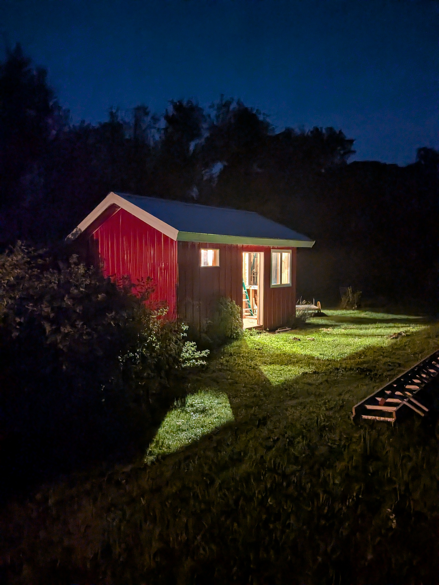
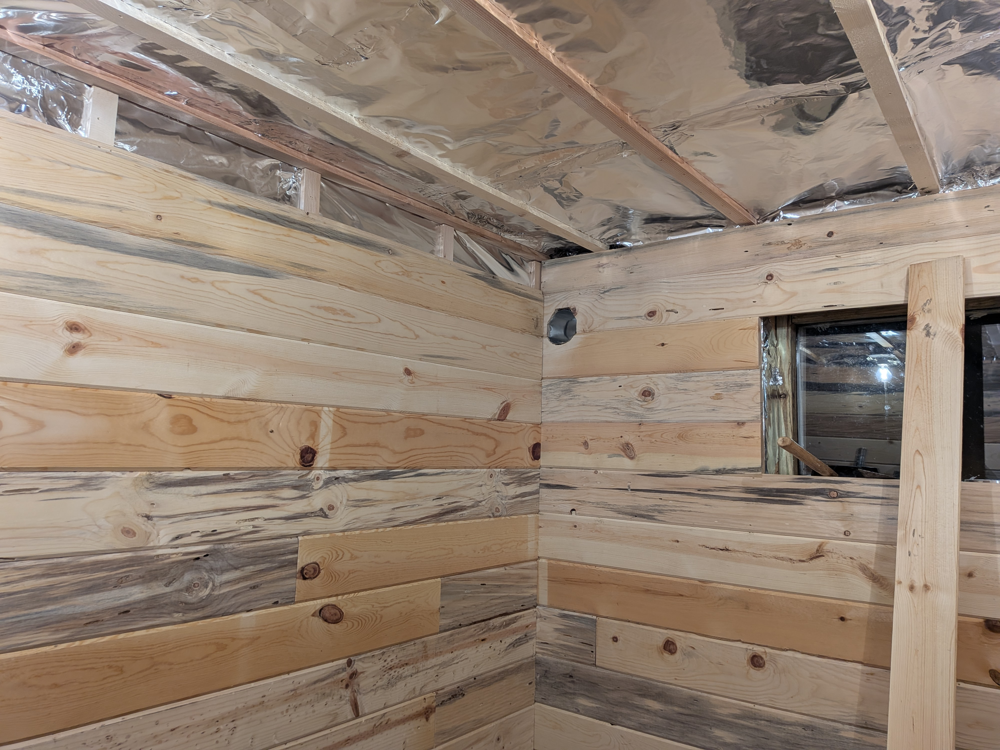
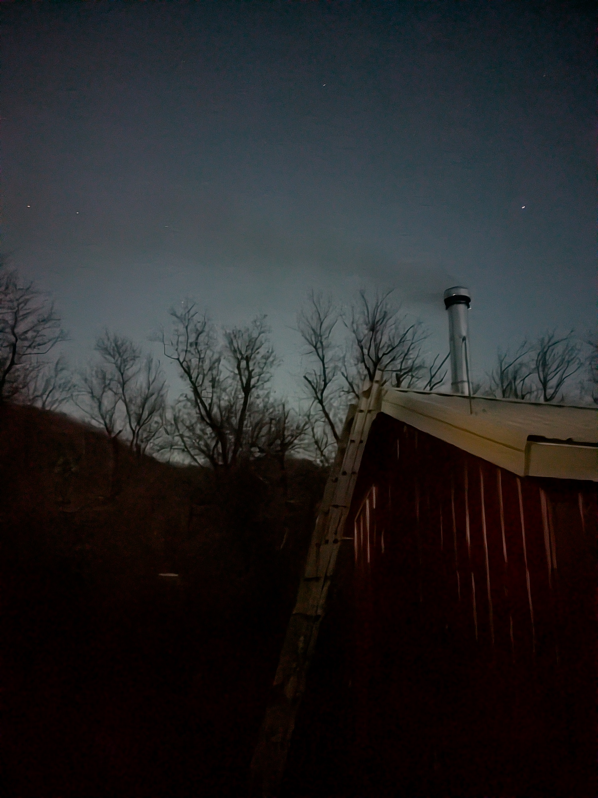
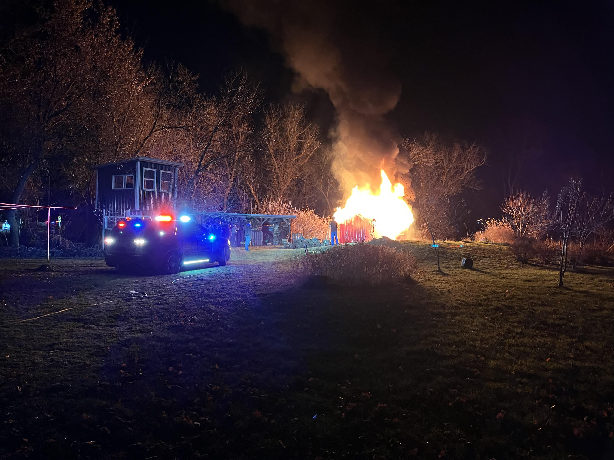
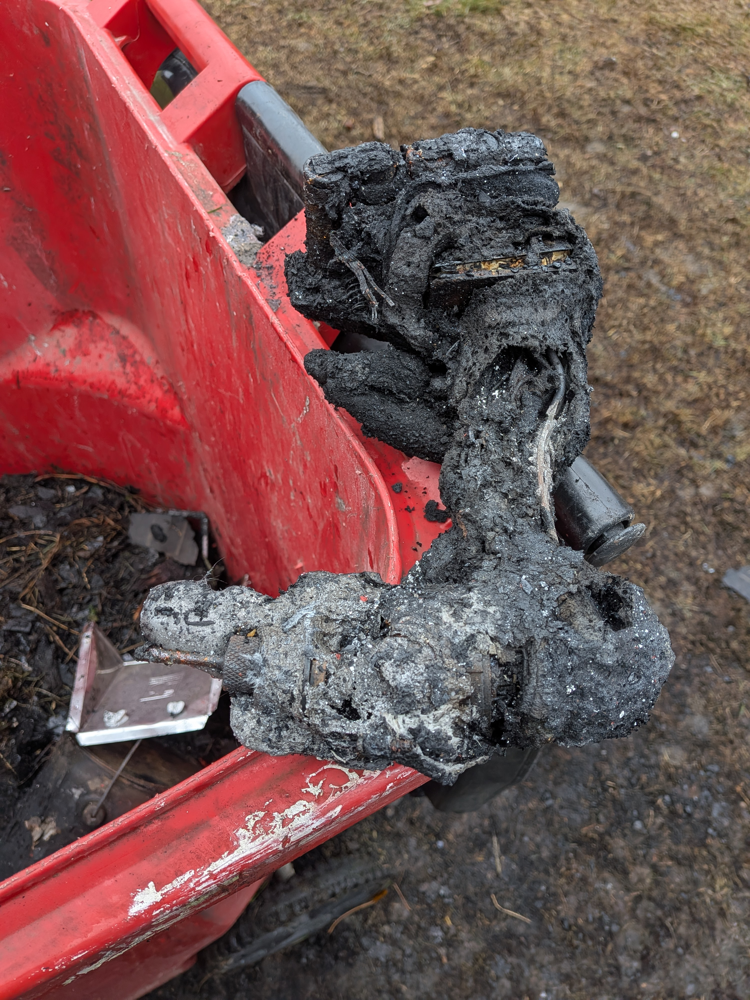

# Sauna/Office Fire

I built the sauna out of roughsawn pine bought at a local auction

 
I fell off the roof while building it.

I ran electricity to the building.

The sauna space, roughly 8' square had an interior foil vapor barrier

The vapor barrier was covered with pine panels

After installing the stove and chimney, I lit a fire.  Things looked ok, so I took a nap.

When I woke up from the nap, the building was in flames.

It was a total loss.

Here's a steel bike that was parked int he office part of the sauna.

Here's an Aluminum fatbike that was parked int he office half.

Cordless drill

Radial arm saw.  Note that Aluminum doesn't stand up to fire.

