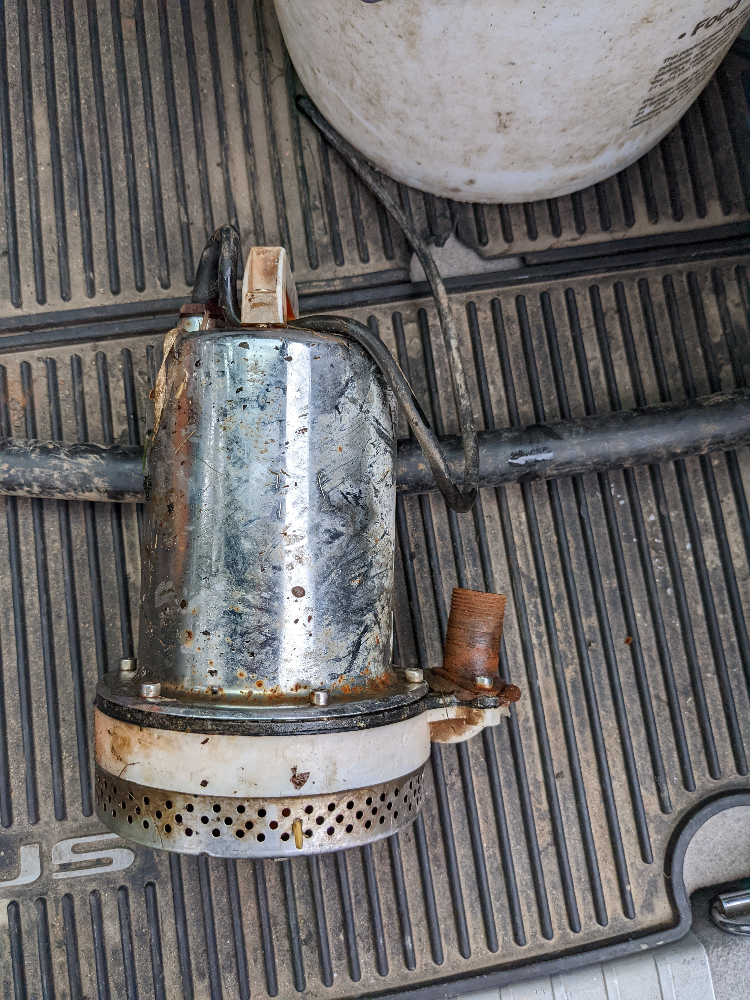
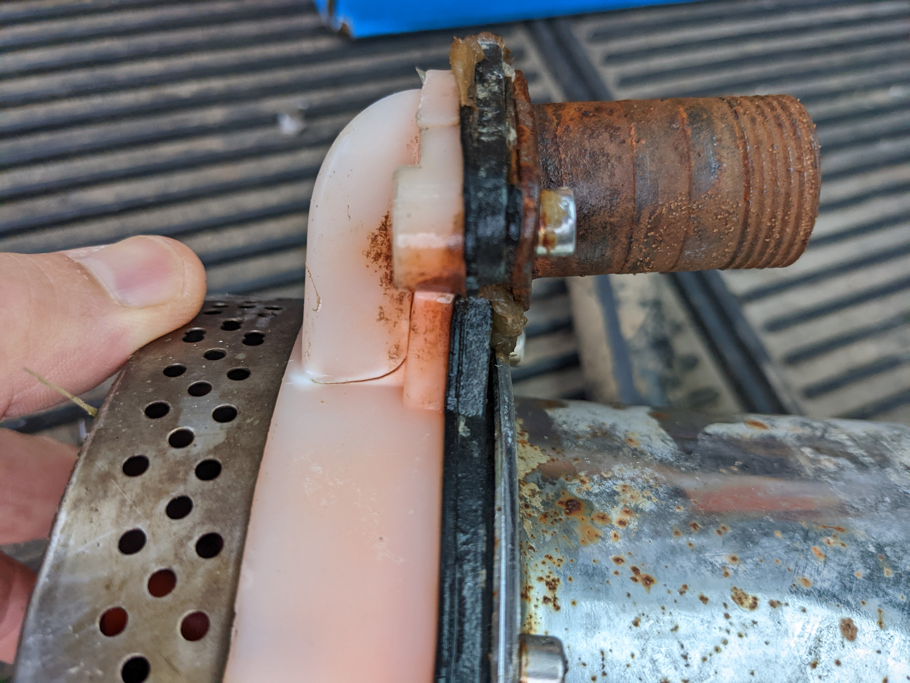

# Solar Water Pump

I use a "trash" pump and a few solar panels to pump water out of a creek to water my garden.  

Here's some video background:
<https://www.youtube.com/watch?v=hd4zJ_MgNK0>

Here's the Amazon product page for the 12v DC pump <https://www.amazon.com/BACOENG-Ranch-Solar-Submersible-Available/dp/B07MG5YW7W/>

