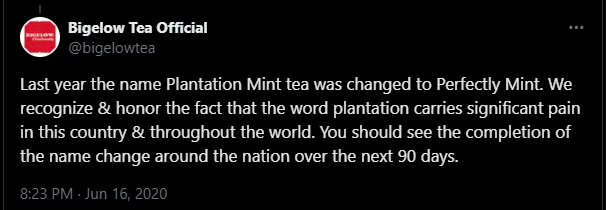

# "Plantation" Mint Tea

George Floyd was murdered in May 25, 2020.

About a month later, Bigelow Tea changed the name of "Plantation Mint" tea to "Perfectly Mint". 

Does this matter? Does this make the world a better place?  

Related, there are still plenty of "Plantation Wedding" venues in the United States.

<https://mounthopeplantation.com/our-story/>

