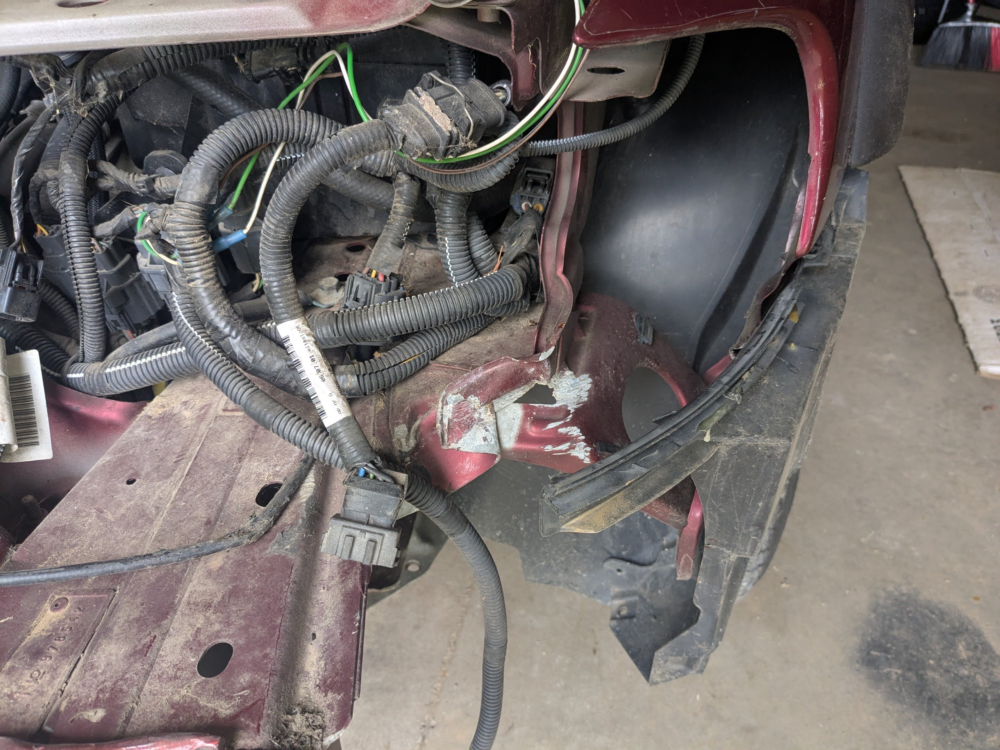

# The Boy hits a deer

My son hit a deer with the Volvo xc70 we fixed up, and we fixed it up again with a pretty unique paint job.  
 
Here's the car before he hit the deer.  

The deer jumped out on the passenger side of the car.  The hood, bumper, right fender, right headlight, and AC evaporator were all damaged.

Taking off all of the broken pieces was straight-forward.  A wire cutter and a 10mm socket was all that was needed.

There were scratches on the driver's side of the front bumper.  It seems clear that the car had hit something else in the previous 20 years of its life. 

We went to the awesome U-Pull-R-Parts in Rosemount MN looking for a new bumper but had no luck with the cars that were in stock.

With most of the broken pieces replaced, the car was again drivable.  The repair took most of a summer to finish. 

