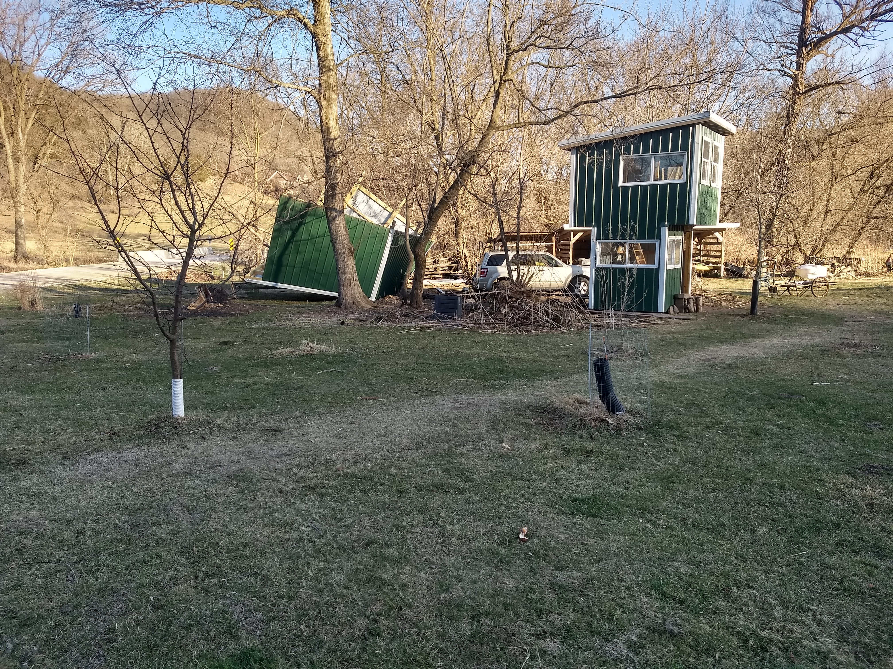
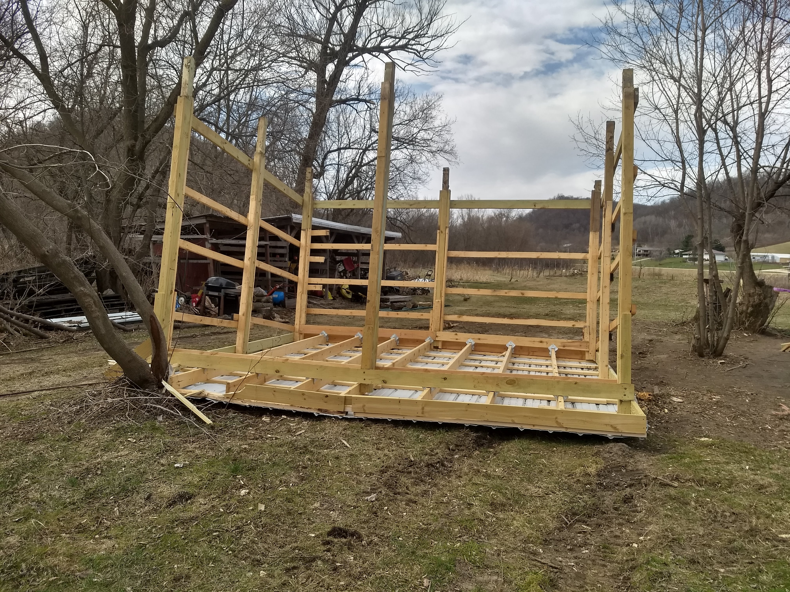

# Woodshed

I build a woodshed a few summers ago.  When I did most of the construction, the weather was quite calm.  The shed footprint is about 16ft wide by 12ft deep.  The back wall is 8' high and covered in steel siding.  The front wall is open to the south and is about 10' high.  The wind in our backyard only blows north or south because we live in a valley.  

A few days after finishing the shed, we had a thunderstorm with strong winds.  The shed tipped over.

Repair was:
1. Rolling the shed back into place with my neighbors truck (pulling) and our tractor (lifing).
2. Pouring 2 bags of concrete mix around each of the vertical posts that went 3' into the ground.
3. replacing the dented and torn steel roofing with new.

