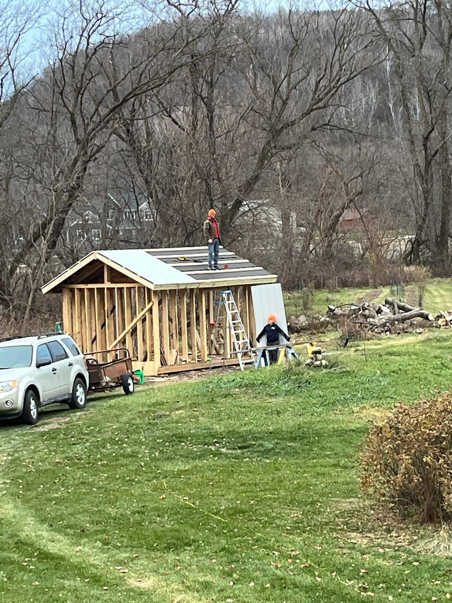
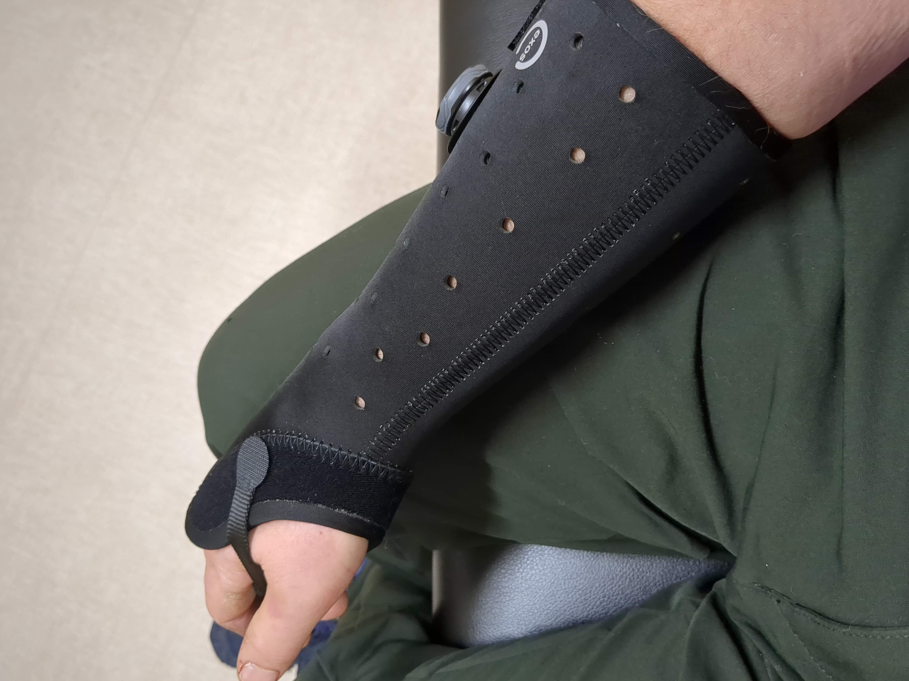

Why am I so lucky? I started slipping down the wet metal roof of the sauna/office I'm building for fun and then was suddenly in the ER at Winona Health getting a CT scan. A little break of my right Radius, fixable by cast, a decent cut from my teeth in my cheek, a mild concussion, and a bent Aluminum ladder are all I have to show for Saturday's 4 hour block of missing memory.

I have sick leave, health insurance, colleagues that can cover work duty, and family that can come, stay, cook, and drive the kids to school. There was no bone sticking out after the fall, no long term memory loss, no other fractures, no coma, no brain or other organ damage, no death.

On Tuesday, I was chatting with a lady in the Gunderson X-Ray/Lab suite who remarked, "I know a lady who just died at 65 and I'm 80! It hardly seems fair!"

So, what lessons should I take?
  - Don't go on a roof.
  - Don't go up a ladder.
  - Don't go on a wet roof.
  - Make sure you fall on a ladder, not the ground.
  - Make sure your wife looks out the kitchen window every once in a while to see that you're ok.
  - Have a nice family that can come and stay with you when your sick.
  - Have a good job with sick time.
  - Have health insurance.
  - Be lucky.
  - Be born into a family, or born into a country where you don't need to be lucky?

One interpretation of the first week of the Christian Advent season is that we should remember the time before Christ came and empathize with the people who are not "lucky" today; the poor, the sick, the dying, the grieving, the unemployed, the persecuted, the imprisoned, the refugee, and the immigrant. [Kelly Latimore's "Holy Family of the Streets" and associated meditation](https://kellylatimoreicons.com/) made my recent luck all the more blatant to me.

Winona Post, 2023-Dec-20

Update, Lifetip: don't take a bunch of ibuprofen after getting a concussion.  In some cases (eg mine) your blood saline level will drop and your wife will have to drive you to the ER. Low saline levels are apparently a common thing in the hospital, and treatment is well understood - a few days (in the hospital) connected to a 3% by mass saline drip.
Can report that the broiled cod was, by far, the best thing on the hospital menu. Top-ten experience with cod - I would have had it for breakfast too!
