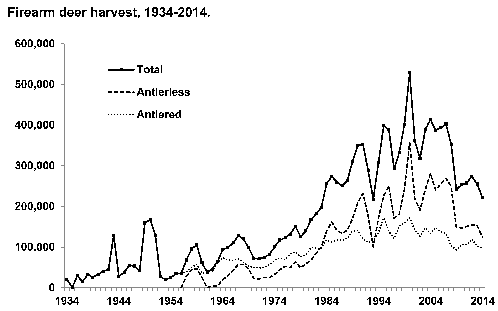
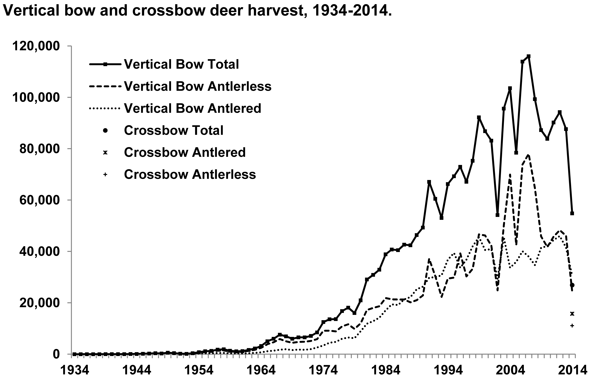
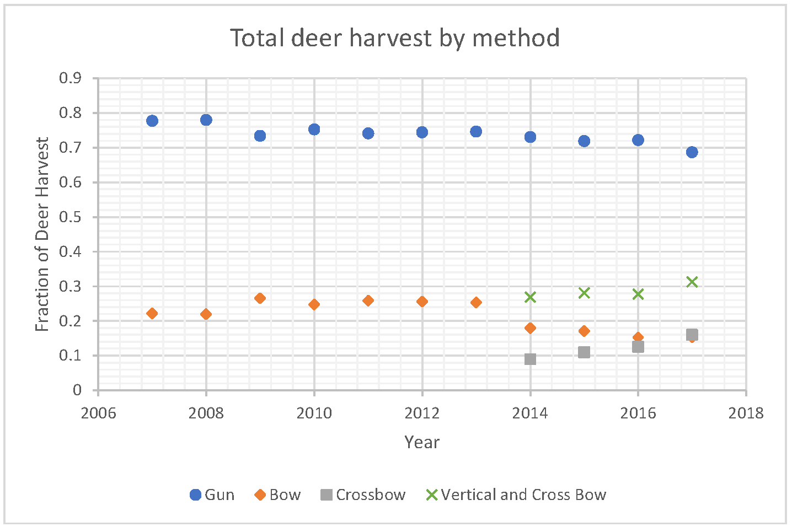
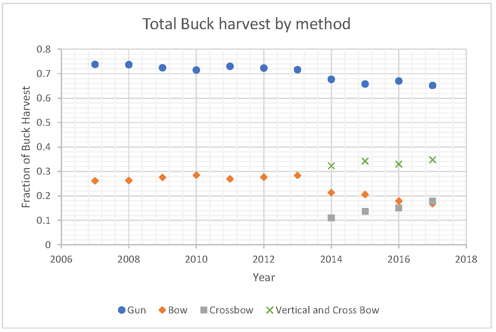

#Sell your shotgun and buy a crossbow

I wrote and submitted this editorial to the MN Outdoor News in February 2018 in response to an article discussing the Minnesota Deer Hunting Association's (MDHA) discussion about whether to lobby for the inclusion of crossbows in the regular archery season.  The paper's editorial position (March 2 issue) is that crossbows shouldn't be allowed, so I'm not optimistic about publication.  

***

Last week's issue led with a story about the MDHA's discussion of whether to lobby for crossbow hunting during Minnesota's archery deer season. Here are 3 arguments in response to the MDHA discussion:

This past summer I read the wild food book, "Nature's Garden," by Samuel Thayer. In it, the author discusses the death of Chris McCandless, which was immortalized in the movie "Into the Wild."  Thayer makes a convincing argument that part of what led to McCandless' death was a continual diet of small rodents, harvested by 22 rifle.  When a lead bullet hits an animal it deforms and fragments.  As every parent knows, there is no safe amount of lead in the blood, and less known is that the average IQ of a population decreases by about 2 points for every 10ug of lead per dL of blood. <https://www.ncbi.nlm.nih.gov/pmc/articles/PMC4675165/>.  Thayer's argument was that McCandless' excessive diet of lead (via rabbits and squirrels) led to cognitive impairment that prevented him from understanding how close he was to starvation.

When you hit a deer in the shoulder with a 12ga slug the same thing happens - the slug expands and fragments and about 1/3 of the venison is contaminated with lead fragments.  They're there whether or not you can see them! Crossbow bolts are tipped with steel blades, and the lead poisoning hazard doesn't exist when you use a crossbow.  Hunting with a crossbow produces safer meat than hunting with lead bullets.

When I started deer hunting I spent most of my time on public land in 345 and 346.  As many people who hunt on public land know, there is nothing so annoying and terrifying as a figure in orange, carrying a shotgun, driving deer your way.  A 12 gauge slug that misses a deer and fragments or ricochets off of a tree will still travel a significant distance. (Imagine the fragments are traveling 600fps for 3 more seconds.  That's a third of a mile!).  Crossbow bolts have an effective range of about 50 yards - in practice that hardly seems different from a smoothbore Mossberg throwing slugs in the woods, and the crossbow doesn't leave a bruise on your shoulder.  In the shotgun zone, we would all be safer from shrapnel and ricochet if we switched to crossbows.  

One subtext from the MDHA story was that because is "easier" to use, a crossbow isn't as sporting as using a compound bow.  There are  two ways to respond to this criticism.  First, please be aware that "Toxic Masculinity" is indeed toxic.  It would be far more difficult and MANLY to chase down a deer and beat it to death with a rock (like humans did back in prehistory days) but that currently isn't a DNR approved method for taking game. It would also be more "sporting" to use a recurve bow and cedar arrows tipped with blades you knapped from beer bottle glass, but they don't sell those at Fleet Farm...

A less confrontational response to the sporting issue is to look at the data.  If crossbows are easier to use and less sporting, they should be dramatically more effective at harvesting deer.  Wisconsin has been allowing crossbows during the archery season since 2014.  Harvest data from WI is online at <https://dnr.wi.gov/topic/wildlifehabitat/reports.html>

I took that data and plotted the deer harvest since 2007 in the following way:  In Graph 1, the vertical axis shows the fraction of the harvest that was taken by Crossbow, Bow, or Gun.  Graph 2 is similar, but this time the vertical axis is the fraction of Antlered deer (Bucks) that were harvested by Crossbow, Bow, or Gun.  

What does the data say?  About 75% of the deer harvested in WI were taken by gun.  An archer is slightly more likely to take a buck than a gun hunter.  After 2014, the fraction of bucks harvested by gun dropped by about 3-5%.  The overall share of deer and bucks taken by all types of archers has been constant over time, with a small increase since 2014 with the introduction of crossbows.

What story does the data tell?  Here is a possible interpretation:  In 2014, about half of the bowhunters bought a crossbow and took a deer with that instead via a vertical bow.  Some gunhunters (about 3-5%) also bought a crossbow and started enjoying the longer season allowed by that tool.  Did archers suddenly become less successful because of the non-sporting crossbow hunters?  No, they still have a reasonable success rate and it isn't possible from the data to decouple people who bought a crossbow from vertical bowhunters who didn't get a deer because of competition from the new guy who moved in.

***

 The raw data to create these plots comes from the Wisconsin DNR, <https://dnr.wi.gov/topic/wildlifehabitat/reports.html>.
 Numbers are only available for the past ~3 years and the two plots below are the bulk of the data provided. To make plots of percentage harvest by method, I imported the data (plot) into Vernier's LoggerPro and then did an image analysis that converted pixel position to (year, harvest) pair.  I did this because I couldn't get <http://datathief.org> to work with the WI DNR graphs.  Typical digitization error seems to be about 5% in each percentage measurement.  The raw data is available as an excel sheet: [WI_deer.xlsx](WI_deer.xlsx).

<figure>

<figcaption>
Deer harvest by gun from the Wisconsin DNR from 1934-2014.  I used this 'raw' data to create the fractional plot at right.
</figcaption>
</figure>

<figure>

<figcaption>
"Deer harvest by archery from the Wisconsin DNR from 1934-2014.  I used this 'raw' data to create the fractional plot at right.">
</figcaption>
</figure>

<figure>

<figcaption>
Graph 1 Total deer harvested in Wisconsin from about 2007 to 2017.  The data is broken down by harvest method.  About 70% of deer are harvested by gun.  The other 30% is harvested by vertical or cross bow.
</figcaption>
</figure>

<figcaption>
Graph 2 Bucks harvested in Wisconsin from 2007 to 2017. The data is broken down by harvest method.  As with the total deer harvest, about 70% of deer are harvested by gun.  The other 30% is harvested by vertical or cross bow.
</figcaption>
</figure>
