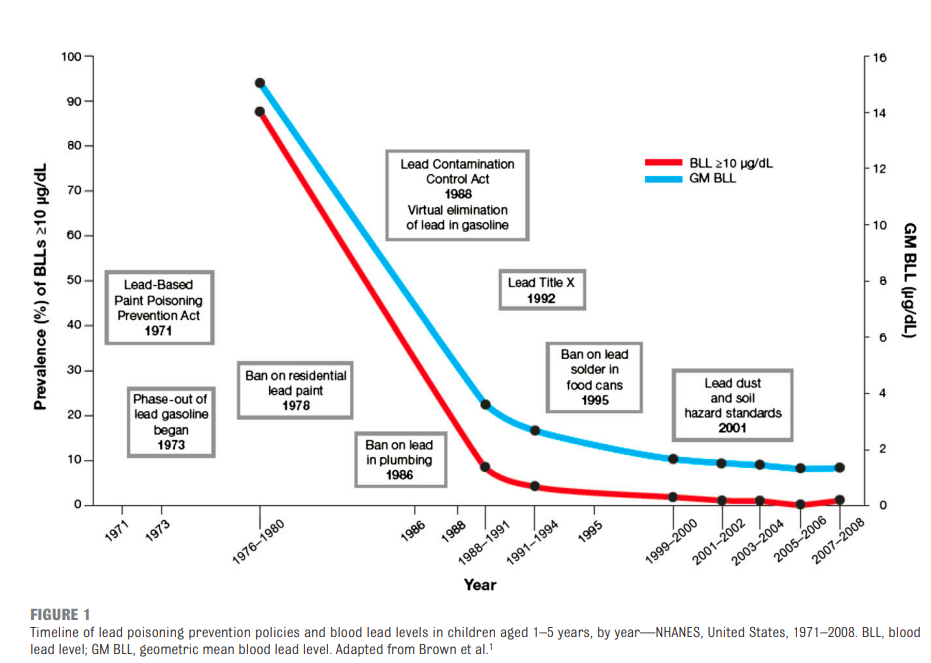

# Guns and Lead Paint

If you want to make really nice paint, get some oil-based Dutch Boy and add ground up lead to it.  The lead will produce brighter colors, reduce drying time, provide better coverage (fewer coats!), and the paint will resist mildew.  However, paint chips, and kids love the sweet taste of lead paint chips.  

Lead solder is cheaper and much easier to melt when you’re soldering plumbing lines or microchips, but lead can leach into water supplies (as anyone in Flint knows).

When mixed with gasoline, lead lubricates mechanical parts in car engines, and adding lead to gas in the 1970’s was one of the key ingredients in having a car last to 100,000 miles. That lead-in-gasoline comes out of the tailpipe, and many city boulevard strips are accordingly coated with lead dust.

Lead is toxic, and because they crawl around on the floor and play in the dirt, children are particularly susceptible to lead contamination. Thankfully, our society has decided that children’s health and IQ scores are more important than high-quality paint, easy soldering, and the lubrication of car engines.  There’s an amazing graph (Figure 1 from the American Association of Pediatrics’ policy statement on the [“Prevention of Childhood Lead Toxicity”](https://publications.aap.org/pediatrics/article/138/1/e20161493/52600/Prevention-of-Childhood-Lead-Toxicity) which shows how government regulation has dramatically reduced the prevalence of this hazard.

<figure>

</figure>

On average, a child’s IQ score drops by about 5 points for every 10ug/dL of lead in their blood, so it isn’t absurd to say that most kids today are smarter than an average 40 year old, because kids today didn’t grow up with the lead hazard that we did.  
 
If you live in an old house and decide to replace your windows, you’ll find that any window near a staircase costs about twice that of a normal window.  If you trip and fall on the stairs, your hand might punch through the window.  With normal glass, the pane will shatter into 100 loose knives, but stairway windows are made from tempered or “safety” glass, which breaks into small rectangles, sometimes held in place by a membrane of plastic.

Safety glass is nearly impossible to cut with a glass cutter, and it’s more expensive to include in a car, but in a crash, do you want the car’s windshield to shatter into knives?  Safety glass has been required for automotive windows since the 1960’s.  Nobody actively thinks about this, and while more expensive to build with, you’re safer for this regulation.  

You can tell the same story about highway speed limits.  After the oil embargo of the 1970’s, and the lifting of national speed limits in 1995, thousands of extra people didn’t, and did die in car crashes.  80mph might not seem much faster than 55mph, but kinetic energy and stopping distance go up as speed squared, and you need more than twice as much distance to stop from 80mph when the big buck jumps out on I-90.  

Regulating guns is no different than regulating lead paint or cars. If people have access to dangerous things, terrible things are more likely to happen.  This is why you don’t give toddlers knives. Why are guns treated and regulated differently than vehicle speed, safety glass, lead paint, Fentanyl, Alcohol, Electrical inspections, or a hundred other potentially dangerous things in our lives? 

Our children, our schools, and our communities deserve safety and security. It seems obvious to me that the rates of mass shootings can be lowered by curtailing the abundance of the guns that are used in mass shootings.

In Winona, our local state representatives have close links to Cotter (Catholic) Schools, which is very similar to the Minneapolis school that just experienced a terrible tragedy, which was directly facilitated by the sea of legally purchased semiautomatic weapons in this country. Will our state legislators vote to restrict access to weapons whose only seeming purpose is killing children?  I hope so. 
