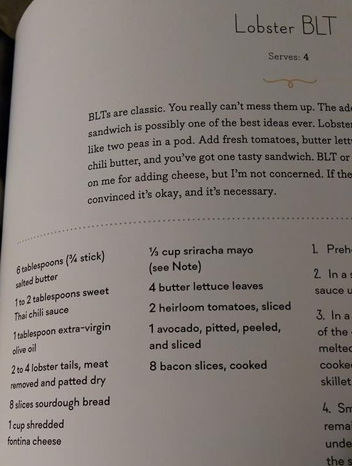
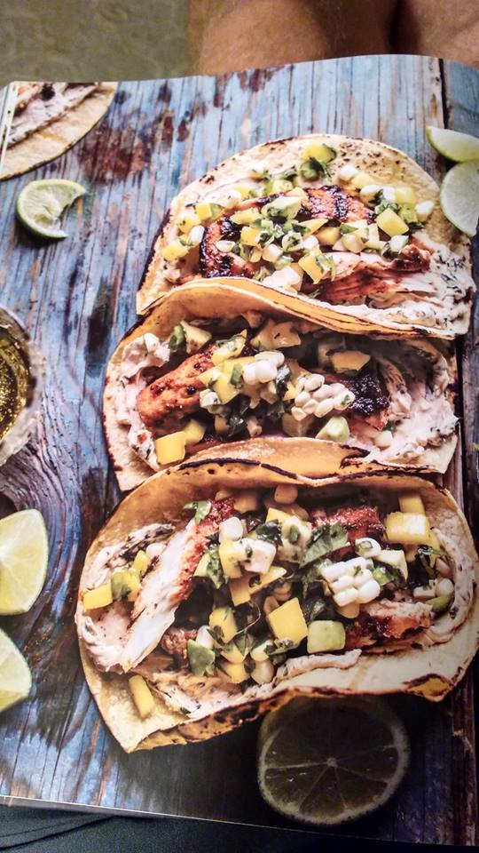
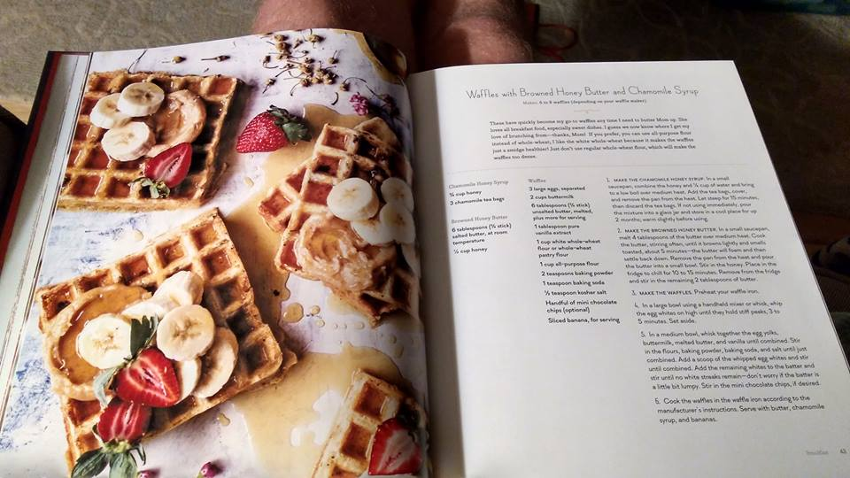
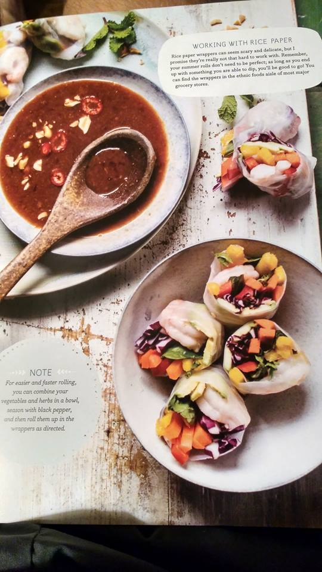

# Lead paint is TOXIC!

We have 4 kids and going out to eat is basically impossible now that nobody eats off the kids' menu.  So, we check books out from the library and cook.  We recently checked out the <https://www.halfbakedharvest.com/>, which is also a blog.  The food sounded ok, and it's certainly more ambitious than I was at 23. I'm not sure how she affords the recipe testing though.  

I give you "Lobster BLT's", page 171:

<figure>

</figure>

 Although the photography is pretty good, about half of the recipes are served on old painted wood.  It's apparent that the author has never gotten "that lecture" from an OB or a pediatrician.  

"Blackened Mahi mahi tacos with a side of 1968 Dutch Boy"

<figure>

</figure>

Seriously, WHO EATS WAFFLES OFF A WHITEWASHED TABLE???? More than one of my children would be licking that table as soon as you turn your back on them.

<figure>

</figure>

More lead paint goodness here. Does she not know how sticky rice paper is?

<figure>

</figure>

Gentle reminder and obligatory reference.  "Shabby Chic" isn't food safe.  <http://www.lead.org.au/fs/fst3.html>

White house paint contained up to 50% lead before 1955!!!!!<https://www.atsdr.cdc.gov/csem/csem.asp?csem=34&po=8>
