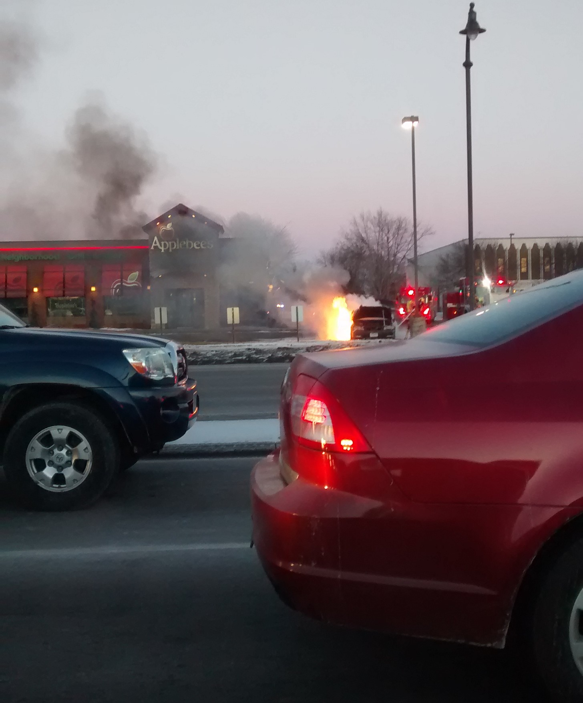
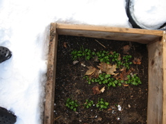
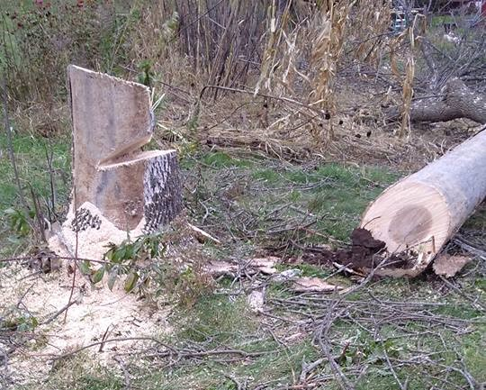

# Everybody has opinions.  Here are some of mine.

I don't pretend to be an ethicist, but occasionally class discussion topics line up with current events.  These are my opinions, not those of the University or the State of Minnesota!

## Coal, Toxic Metals, and Air Quality
[Electric Mowers](lawn_mowers.md) are awesome! Everyone should buy them! Gas-powered small engines should be illegal - especially if you mulch vegetables with grass clippings!

[Build a Corsi-Rosenthal filter box](strib_PM2.5.md) when the PM2.5 air pollutant level gets high. 

Estimated Mercury (Hg) emissions from MN coal plants before the "Mercury and Air Toxics Standards" (MATS) went into effect.  Note, these standards are part of the "War on Coal."  After a few tries, [Here's the version](Henry_trout.md) that was finally printed.

[Here's another letter](mats_standards.md) that talks about the polluted history of the Industrial North-East United States (and not eating fish there!).

Trim and siding boards made from coal ash - what could possibly go wrong?  [A letter](coal_ash_trim.md) I sent to the Editors at Family Handyman Magazine.

Not a letter per say, but lots of modern food/decorating books feature "Shabby Chic" decorating that uses old stuff with peeling paint. Before 1955, up to 50% of white house paint could be lead!  [Here's an example book](lead_paint_cooking.md).

Should hunters be able to use crossbows for deer during the regular archery season?  YES! [Here are three arguments](./crossbow-feb2018/crossbow_editorial.md), two of which involve lead poisoning.

## Chronic Wasting Disease (CWD)

Chronic Wasting Disease (CWD) has again been found in south-east Minnesota.  Given that the chance of harvesting a deer with CWD is now greater than that of dying in a car crash, I think the DNR should mandate testing of every deer harvested south of Minneapolis.  [Here's my argument](cwd_kids.md) in "letter to the editor" length.

[Followup Letter](cwd_plants.md): CWD can be transmitted to plants, which can transmit CWD back to animals.  

[How to clean a knife](cwd_knives.md): How does the CDC recommend you clean a surgical instrument that comes into contact with the human equivalent of CWD prion?

[Fleet Farm sells "Deer Corn" and "Wild Deer Feed"](fleet_farm_deer_corn.md) in the hunting section of the store.  It is illegal to feed (bait) deer within about 60 miles of this store.

Let's treat CWD like [your body treats the chickenpox virus](CWD_chickenpox.md) - Cash awards for positive cases!

Who takes [legal responsibility](deer_legal.md) for the deer that destroy fruit trees?  I

## Code of Conduct
Not a letter. Given the way that people relate to eachother nowadays, and further, given the historic discrimination against women in Physics, in my classes I ask that students abide by a code of conduct. [Code of Conduct](code_of_conduct.md)

## Other Letters

First-world societies regulate health hazards so that people live healthier and happier lives.  [Gun regulation should be as obvious as lead paint regulation.](guns_and_lead_paint.md)

Cotter High School bought and intends to demolish Lourdes Hall, a building used by the [College of St. Teresa](https://en.wikipedia.org/wiki/College_of_Saint_Teresa) and later [Winona State University](https://winonan.org/14036/news/end-of-an-era-and-hope-for-the-future-alumni-visit-lourdes-hall-for-a-final-goodbye/). (College) "Kids today" don't want to stay in a small dorm room with large shared bathrooms, and the space has been vacant for a few years.  When the high school bought the building and announced their intention to demolish it and replace it with a shared athletic space, lots of people wrote to the local paper, [agitating](https://www.winonapost.com/news/too-late-to-block-lourdes-hall-demolition/article_a64faf31-82ab-4051-86d7-52aeaec4bd06.html)  for some sort of extravagant historical preservation project.  [Here's a letter](old_buildings.md) I wrote about energy efficiency, weeding the garden, and different notions of beauty.     

I fell off the roof of a Sauna/Office I'm building. If I hadn't landed on the ladder, the 9ft=3m drop would have brought be to the ground at ~18mph. But the ladder was there and I had minimal injury. I don't feel great about how lucky I was. [Here's a letter](Falling_off_a_roof.md) I wrote, motivated in part by a [Kelly Latimore Icon](https://kellylatimoreicons.com/).

I have Celiac Disease, an auto-immune disease that is triggered by the gluten in Rye, Barley, or Wheat. I attend a Catholic parish in Winona.  [Here's a letter](Wheat_and_communion.md) I sent to the Bishop relating to their insistence on using wheat-containing communion bread.  

Going in for a colonoscopy?  [Don't bring your pistol.](guns_and_colonoscopy.md)  Not joking.

What's the [distribution of swingsets](swingsets.md) in Winona? 

Semi-trucks should [pay their fair share](road_damage.md) for the damage they cause to the roads.

I was wrong on this one.  A goat was seized at the Winona Tires Plus and [I took a contrarian position](meat_fur_feathers.md)  that turned out to be wrong.

<figure>

<figcaption>
A car on fire in front of an Applebees.  Cars are patiently waiting in line to turn at a stoplight.  The scene has the feeling of the Wizard of Oz, Pay no attention to the man behind the curtain
</figcaption>
</figure>

<figure>

<figcaption>
Spinach, in a cold frame surrounded by snow, in December.  I grew this spinach and then kept it alive through the winter with a cold frame.  It was amazing.
</figcaption>
</figure>

<figure>

<figcaption>
The stump of a fallen tree with a poorly done felling notch cut. I make mistakes (like this cut) all the time.
</figcaption>
</figure>
