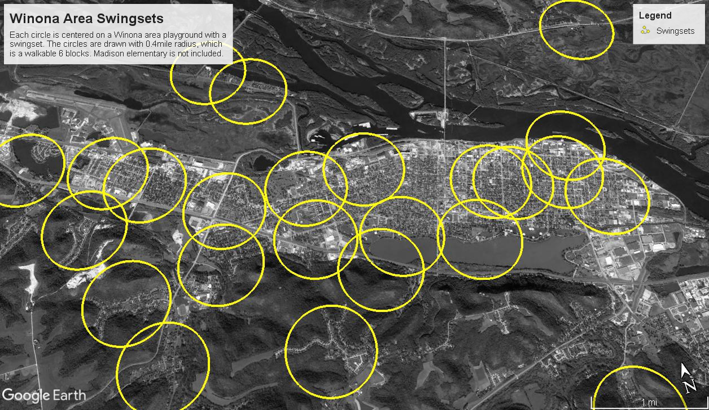
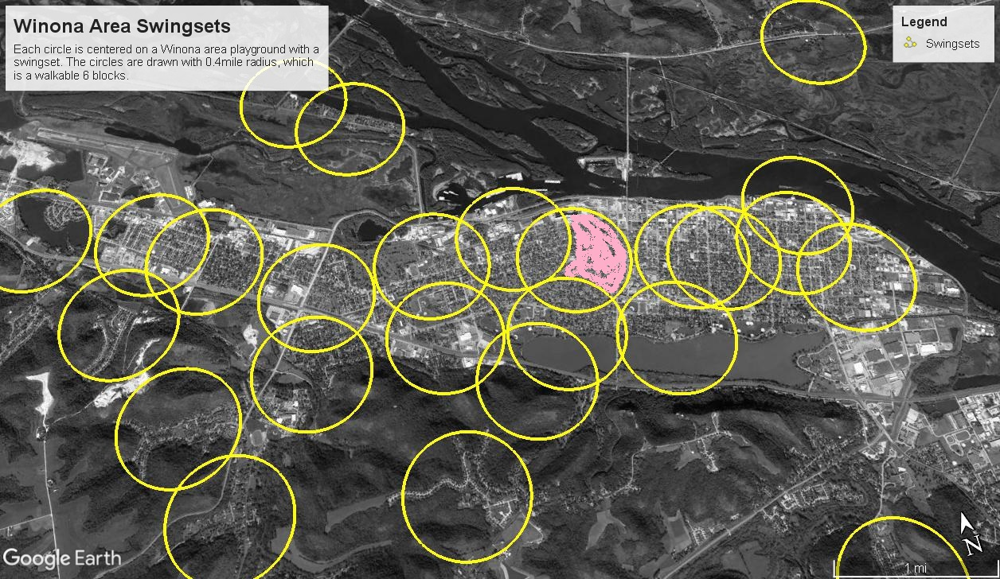

# Distribution of Swingsets in Winona

Madison Elementary school in Winona was sold in 2018 to a developer who, as of Feb 2019, plans to turn the school into apartments.  Madison occupies a city block and the kids' play space will likely be turned into a parking lot.  

Here's the article that motivated this letter.
<http://www.winonapost.com/Article/ArticleID/62696/Apartments-senior-living-proposed-for-Madison> 

***

Dear Editor,

About three days into our week of snowy cold "vacation" last week everyone in our house went a little stir-crazy.  By the end of the day Wednesday it was all the way up to -9F, so we forced the kids out the door and walked down to the creek.  The spring creek wasn't frozen, the kids all made it 5 minutes before crying on the way into the house, and, as a Minnesotan, I'll tell you that aside from the wind, so long as you didn't breathe through your mouth, it wasn't that bad.  

Most people with kids have learned that everyone's sanity requires that children get time outside.  A morning of playing legos, or an hour of Minecraft will quickly devolve into an afternoon of crying, yelling, and threats if the kids don't have a chance to run around.  At school, this is called recess. Ask any teacher, it is ESSENTIAL!

It was discouraging to read an article in the Winona Post this weekend about the redevelopment of Madison school.  Along with a learning garden, like all schools, Madison currently has a large public playground and space for kids to run around.  If you measure, nearly 60% of the Madison block (4900m^2) is devoted to public play space.  Any redevelopment will require a large parking lot.  I haven't seen the plan, but it's hard to imagine there will be as much playground space when the project is finished.  The developer's proposed public playground is 60'x45', an area of about (250m^2).

Devil's Advocate: There are lots of playgrounds in Winona.  Losing Madison's won't be a big deal.  I wondered about this, and made a map on Google Earth of all of the swingsets in Winona.  Minneapolis' park standard is that every resident should be within 6 blocks of a playground.  Six Winona blocks is a distance of about 700 meters or 0.4 miles.  So, on the map every swingset is surrounded by a circle of reasonable walking distance.  Ie, if you live within one of the circles, it's less that 6 blocks walk to a swingset.  

Look at the map and tell the person next to you what's missing.  

<figure>

<figcaption>
Winona area swingsets.  Madison Elementary is not included.
</figcaption>
</figure>

So far as I can tell, Hidden Valley and the houses around Sugarloaf don't have a walkable swingset available. Nearly every other three-year old in Winona can swing to their heart's content.  

Also, you may have noticed that I didn't plot a circle around Madison.  We don't yet know if that public playground will survive.  

<figure>

<figcaption>
Winona area swingsets.  The walkable playground area that corresponds to Madison Elementary (and could be lost to redevelopment) is shaded. 
</figcaption>
</figure>
